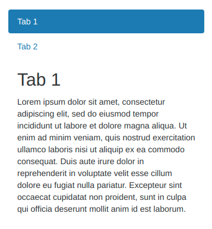
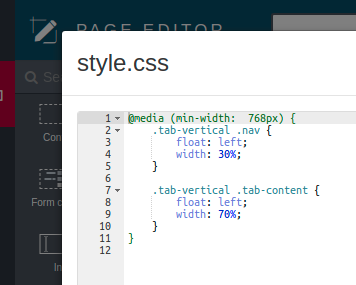

# How to display a vertical tabs container on all devices

::: warning
**:fa-exclamation-triangle: Warning:** This tutorial is using "Vertical tabs container" available since Bonita 7.9
:::

## Goal: Display stacked tabs on mobile and juxtaposed tabs on desktop
Since Bonita 7.9, tabs container can be configured `Vertically` by displaying tabs as `pills`. This is useful for displaying tabs on mobiles (tabs and contents are stacked) but not on large devices (tabs content should be displayed on the right, not below). To have a tabs container well displayed on all devices, you just need to add some css rules as described below.

 <!--{.img-responsive .img-thumbnail}-->

 <!--{.img-responsive .img-thumbnail}-->

## Step 1: Configure the tabs container
The tabs container must be configured `Vertically` with type `pills` and must have a css class (for example `tab-vertical`) as follows:
 <!--{.img-responsive .img-thumbnail}-->

## Step 2: Add css rules in a css file
Add this following css rules in a new CSS asset or in an existing asset:
```css
@media (min-width:  768px) {
    .tab-vertical .nav {
        float: left;
        width: 30%;
    }

    .tab-vertical .tab-content {
        float: left;
        width: 70%;
    }
}
```
 <!--{.img-responsive .img-thumbnail}-->
